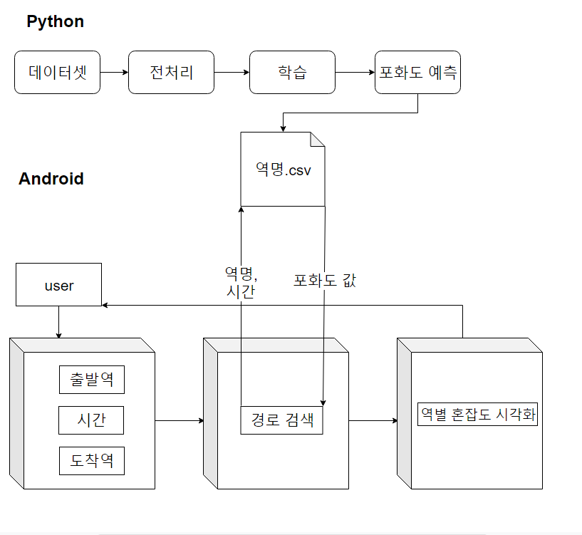
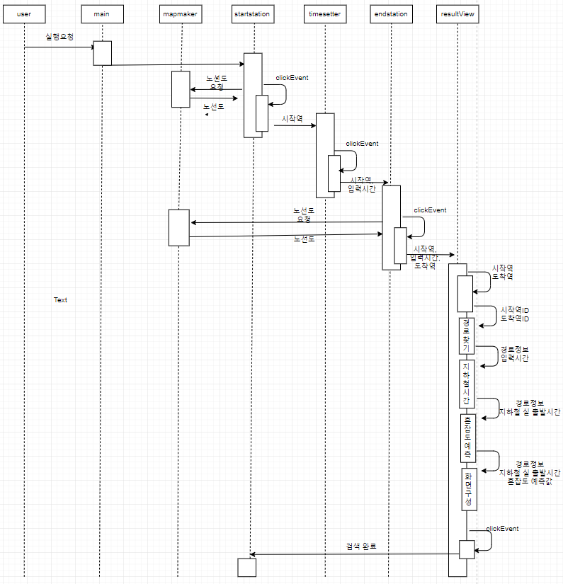
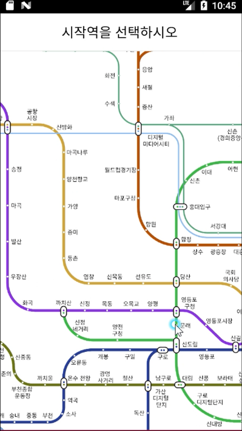
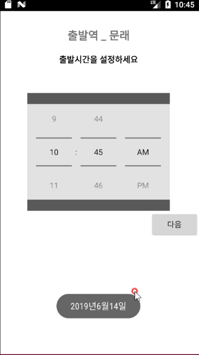
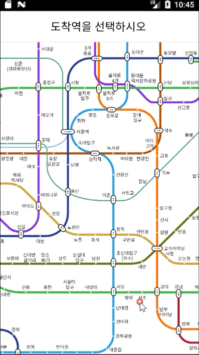

# 지하철 혼잡도 예측 앱
## 캡스톤설계

지하철의 포화도는 계속 증가하는 추세이며, 이용객들에게 큰 불편을 안겨주고 있다. 따라서 본 프로젝트에서는 LSTM을 기반으로 전 역의 시간별 탑승 인원을 예측하는 방법을 제안한다. 제안된 모델은 전 역의 승차 인원에서 하차 인원의 수를 뺀 값인 탑승 인원을 입력으로 순환 신경망 네트워크 구조를 이용해 생성한다, 또한 사용자의 편의성을 위해 어플로 제작을 하였다. 이를 통해 전 역의 지하철 포화도를 계산, 이용객들에게 현재 시각 지하철의 포화도 제공, 이용자들의 분산효과, 정부 기관의 지하철 시간표 조정과 예산할당의 지표로 활용하는 등의 효과를 기대할 수 있다.

- 지하철 혼잡도를 예측하여 혼잡도가 적은 시간에 지하철을 이용 하는것을 목표
- 4명 구성원 (컴퓨터과학과2명, 수학과2명) 3개월 작업.

## Features

- 공공데이터포털 데이터 이용 
- 전처리 과정을 이용하여 데이터 추출 및 가공
- 전 역의 탑승인원 예측 후 각 시간별 지하철 포화도 예측
- 예측된 포화도 값을 어플을 사용하여 사용자에게 시각화 하여 제공
    - 	혼잡도별 크기에 따라 색깔로 구분하여 표시
	경로에 대한 모든 혼잡도 표시
	사용자로부터 시작역, 시간, 도착역을 입력으로 받음

## Tech

- Pandas - raw 데이터 처리
   - 2호선 전체 역의 데이터는 24의 column으로 이루어져 있다. 날짜, 역번호, 역명, 구분(승차, 하차)와 05~06,06~07….24~ 까지의  column이존재 하므로 승차값에서 하차값을 빼야 한다. 이 과정은 승차, 하차로 구분되어 있는 값을 승차에서 하차값을 빼고 하차의 column을 지워 해결하였다. 06~07뒤의 19개column들을 row로 변환시켜주어야 한다. 이 과정에서 Pandas의 dataframe.melt를 사용하여 날짜, 역번호, 역명, 탑승인원으로 전처리를 완료하였다.

-  Tensorflow - LSTM을 모델링과 혼잡도 예측 
    -  학습을 위해 딥러닝 프레임워크중 하나인 케라스를 택하였고, 시계열 데이터 학습에 용이한 LSTM 네트워크를 사용하였다. 모델을 구성하는 방식은 Iterative 방식으로 오차의 값을 최소화하는 방향으로 구성하였고, 모델에 들어가는 유닛의 개수 또한 똑같은 방식으로 구성하였다. 
    

- android studio - android app 구현
     - 오디세이API : 지하철 노선도 출력과 경로및 시간을 가져오기 위해 API 오버라이딩 사용하였다. 이를 예측된 값과 연동하여 포화도를 시각화 하여 사용자에게 제공하는 방식으로 구현하였다.

 
## Review
지하철 혼잡도를 예측하면 지하철 수용인원 대비 탑승 인원을 계산하여 전 역의 지하철 혼잡도를 계산할 수 있을 것이다. 이를 통해 이용객들에게 출퇴근 시간대 특정 시점에서의 지하철 혼잡도를 제공할 수 있으며, 비교적 적은 혼잡도에서 편안한 지하철 이용을 가능하게 하는 서비스를 만들 수 있다. 많은 사람이 이러한 혼잡도를 보고 지하철을 이용한다면 분산효과를 기대할 수 있으며 이는 지하철 이용의 불편 감소로 이어지는 긍정적인 영향을 가져올 수 있다. 또한, 정부 기관에서는 미래의 탑승 인원을 예상하여 지하철 시간표를 조정할 수 있고, 예산할당의 지표로 삼을 수 있다.

- 프로젝트명
- 프로젝트 목적, 설명, 차이점(벤치마킹)
- 기간, 구성원, 사용 기술
- 담당업무
- DB(ERD 필수)
- 구현화면(실제 화면) + 설명 + 느낀점(구현 기능에 대한 기술적, 개인적 느낌)
- 최종 후기(1. 총평, 2. 자신의 기술 향상에 대해서..  프로젝트 전후로 개인 실력 차이? 3. 구성원으로서의 후기.. 팀원들 간의 의견 조율, 본인 의견 주장, 트러블 발생시 해결 방법? 느낀점)

## Deploy Diagram

## Flow Chart

## implementation screen 

## License

MIT

[//]: # (These are reference links used in the body of this note and get stripped out when the markdown processor does its job. There is no need to format nicely because it shouldn't be seen. Thanks SO - http://stackoverflow.com/questions/4823468/store-comments-in-markdown-syntax)
